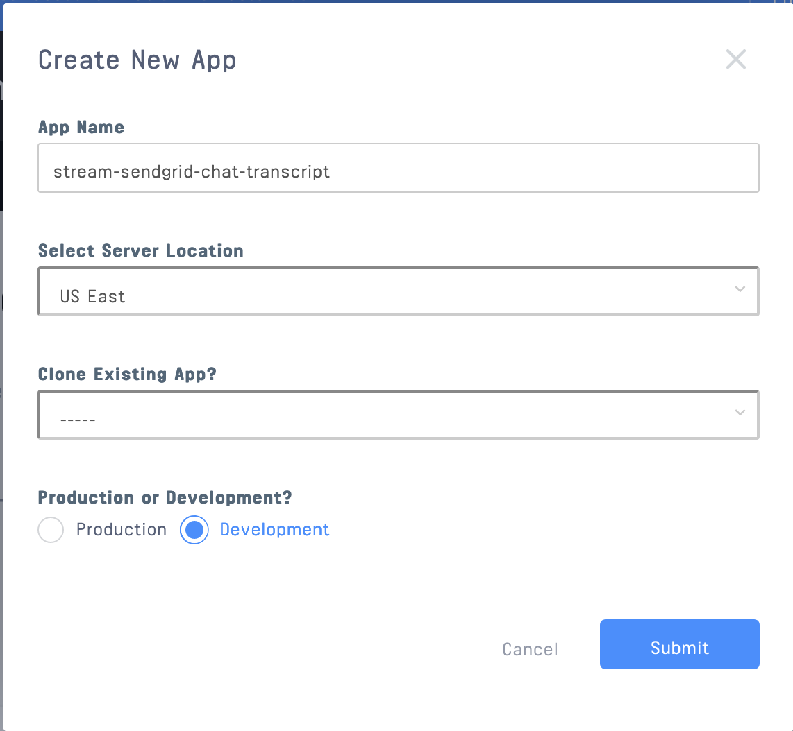
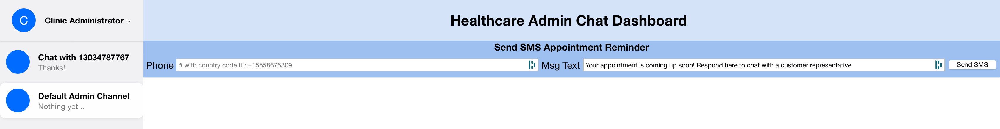
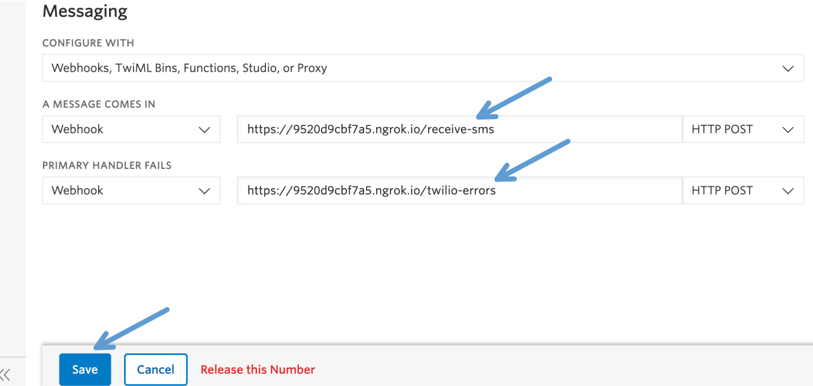

# Send SMS Appointment Reminders + Send and Recieve SMS Texts In A Chat App 

> **This powerful Chat Dashboard allows healthcare administrators to send SMS appointment reminders to patients, and opens a new a chat when patients reply to reminders.**

NEW GIF HERE

## Background

This tutorial will guide you through a no-nonsense, easy-to-build chat app that can send and recieve SMS text messages, and send SMS appointment reminders. It has a side panel showing all active chats (a-la iMessage), and it can serve as a jumping-off-point for your fully customized admin dashboard. We'll be using Stream, Twilio, and ngrok for this example. Stream will power all the chat infrastructure, Twilio provides telephony for our SMS messages, and ngrok provides a publically available URL for Stream's wehbooks. This app is build with Node.js and React, but the methodologies can be easily ported to most languages and frameworks.

Oh wurd? You want that git? [repo here](https://github.com/isaidspaghetti/stream-sms-reminder)!

### What is Stream Chat?

>*Build real-time chat in less time. Connect patients with administrators and doctors with [HIPAA Compliant](https://getstream.io/blog/hipaa-chat/) Stream Chat messaging platform API & SDKs. Rapidly ship in-app messaging with a highly reliable, scalable chat infrastructure.*
>- [Stream Chat & Messaging](https://getstream.io/chat/)

## Prerequisites

- Basic knowledge of [React Hooks](https://reactjs.org/docs/hooks-intro.html) and [Express](https://expressjs.com/en/api.html). 
- [node.js](https://docs.npmjs.com/downloading-and-installing-node-js-and-npm)
- [React](https://reactjs.org/docs/getting-started.html)
- A (free) [Stream](https://getstream.io/dashboard/) Trial Account
- A (free) [twilio](https://www.twilio.com/try-twilio) Trial Account
- A (free) [ngrok](https://dashboard.ngrok.com/get-started/setup) Account

## Outline
- Build the admin dashboard
>- Set up Stream account
>- Admin login form
>- Login endpoint
>- Render dashboard
- Send Appointment Reminder
>- Admin SMS Reminder form
>- Set up Twilio account
>- Reminder endpoint
- Recieve an SMS Reply
>- Setup ngrok
>- Send a Twilio webhook
>- Recieve a Twilio webhook
- Send SMS messages from a Stream Chat
>- Send a Stream webhook
>- Receive a Stream webhook

## Frontend UI

>This app is split into `frontend` and `backend` folders which will use [Stream's React Components](https://github.com/GetStream/stream-chat-react) and [JavaScript Libraries](https://github.com/GetStream/stream-js), respectively. So let's get your Stream account set up first.

### Stream Configuration

Sign up for your [free Stream trial](https://getstream.io/). Then get to the dashboard to create a new Stream app and grab an API Key and Secret.

1. You can get to the dashboard from this button


2. From the dashboard, hit that 'Create App' button


3. Give your app a name and select 'Development' mode



4. This will generate an API key and Secret which we'll add to a `.env` file.


### `.env` Configuration

The[Git Repo](https://github.com/isaidspaghetti/stream-sms-reminder) contains a file in `backend` titled `.env.example`. Add your Stream API Key and Stream Secret here, then rename the file to `.env`. 

<!-- https://gist.github.com/isaidspaghetti/9315e828416e077cd46b069b60703afd -->
```bash
//backend/.env.example:1
NODE_ENV=development
PORT=8080

STREAM_API_KEY= your Stream API key here
STREAM_API_SECRET= your Stream API secret here
```

### Login Form

The login page has simple React form that uses state variables to record changing inputs. 


You'll obviously want to add your credential securities for a production app, but that's out of our scope in this post. We'll keep it for this example to show you how to collect necessary data to register a Stream user with the backend. For a more detailed explanation on how to build a simple React login form, [check out this post](https://getstream.io/blog/how-to-capture-leads-from-live-chat-in-hubspot/). Here's the code for the form:

<!-- https://gist.github.com/isaidspaghetti/f2f22240ad91804fc670030cd7649d9f -->
```jsx
//frontend/src/Admin.js:127
return (
  <div className="App container">
    <form className="card" onSubmit={register}>
      <label>Admin Id</label>
      <input
        type="text"
        value={adminId}
        onChange={(e) => setAdminId(e.target.value)}
        placeholder="Enter your admin ID"
        required
      />
      <button type="submit">
        Start chat
      </button>
    </form>
  </div>
);
```

When submitted the form triggers the `register` function, which will make a simple `HTTP` `POST` to our backend. (In the snippet below the `// ...` is the part that handles the response from the `backend`. We'll get to that in a minute).

<!-- https://gist.github.com/isaidspaghetti/aaacfd3ca10ab707613a57566e884633 -->
```jsx
//backend/src/Admin.js:24
const register = async (e) => {
  try {
    e.preventDefault();
    const response = await fetch('http://localhost:8080/admin-login', {
      method: 'POST',
      headers: {
        'Accept': 'application/json',
        'Content-Type': 'application/json',
      },
      body: JSON.stringify({
        adminId,
      }),
    });

    // ...

  } catch (e) {
    console.error(e);
  }
};
```

### Login Endpoint

To register a Stream user, we need to first confirm our Stream account from our `backend` by sending our `streamApiKey` and `streamApiSecret` we just set up. 

<!-- https://gist.github.com/isaidspaghetti/0a79ef5a1169e9db232ae31502ff55ce -->
```javascript
//backend/routes/index.js:5
const streamApiKey = process.env.STREAM_API_KEY;
const streamApiSecret = process.env.STREAM_API_SECRET;

const serverSideClient = new StreamChat(
  streamApiKey,
  streamApiSecret
);
```

>Good to keep in mind: all of our complex chat functionality will be handled by Stream methods called with `serverSideClient``.method()`.

Next, our `/admin-login` endpoint recieves the form inputs from the `frontend`, and sets up the rest of the client settings. 

>- Each user needs a token: use `createToken()`
>- To add [users](https://getstream.io/chat/docs/init_and_users/?language=js) to the client from a `backend`, use `updateUser()`
>- [Channels](https://getstream.io/chat/docs/?language=js) represent each chat. (We'll create a default channel of the `'messaging'` type)
>- `frontend` Stream apps need a registered `username`, `token`, and `streamApiKey`.

<!-- https://gist.github.com/isaidspaghetti/09da8edff07558206b5c444179a2c50d -->
```javascript
//backend/routes/index.js:13
router.post('/admin-login', async (req, res) => {
  try {
    const username = req.body.adminId.replace(/\s/g, '_').toLowerCase();
    const token = serverSideClient.createToken(username);

    await serverSideClient.updateUser(
      {
        id: username,
        role: 'admin'
      },
      token
    );

    const channel = serverSideClient.channel('messaging', "livechat", {
      name: "Default Admin Channel",
      created_by: { id: username }
    });

    await channel.create();
    await channel.addMembers([username]);

    res.status(200).json({
      adminName: username,
      token,
      streamApiKey,
    });

  } catch (err) {
    console.error(err);
    res.status(500).json({ error: err.message });
  }
});
```

### Start A Frontend Stream Chat

I know it's killing you to learn what was in that `// ...`. Now's your time! Let's look at the rest of that `frontend` `register` function, which will receive the `backend` `response` to start a Stream chat in the browser.

<!-- https://gist.github.com/isaidspaghetti/2bb83fee9d2c7f512fd9055991143b9d -->
```jsx
//frontend/src/Admin.js:24
const register = async (e) => {
  try {
    e.preventDefault();
    const response = await fetch('http://localhost:8080/admin-login', {
      method: 'POST',
      headers: {
        'Accept': 'application/json',
        'Content-Type': 'application/json',
      },
      body: JSON.stringify({
        adminId,
      }),
    });

    const { token, streamApiKey, adminName } = await response.json();

    chatClient = new StreamChat(streamApiKey);

    await chatClient.setUser(
      {
        id: adminName,
        name: 'Clinic Administrator'
      },
      token,
    );

    setLoggedIn(true);

  } catch (e) {
    console.error(e);
  }
};
```

We destructure the `response`, establish a `frontend` instance of Stream (`chatClient`), and configure our user with `setUser`. Let's see why we set the state variable, `setLoggIn` to `true`.

### Frontend Chat Window

Here's the `jsx` that renders our app. Notice how we use `loggedIn` to determine wheter to render a login form or a `<Chat />` component. Each of the components below are provided by Stream. (`Chat`, `ChannelList`, `Channel`, `Window`, `MessageList`, and `MessageInput`). There are [many others](https://getstream.github.io/stream-chat-react/) to choose from.

<!-- https://gist.github.com/isaidspaghetti/9fcab9b62c228255c8dbe6bfed31d65e -->
```jsx
//frontend/src/Admin.js:84
if (loggedIn) {
    return (
      <Chat client={chatClient} theme={"commerce light"}>
        <ChannelList
          sort={{ last_message_at: -1 }}
          Preview={ChannelPreviewMessenger}
        />
        <Channel>
          <Window>
            // ... SMS Alert form goes here
            <MessageList />
            <MessageInput focus />
          </Window>
          <Thread />
        </Channel>
      </Chat >
    );
  } else {
    return (
      // ...Login Form
    );
  }
}
```

This code yeilds: 


Congrats! You've got a basic Stream Chat up and running. Now, let's make it a `spice meatball` with the SMS reminders.


## SMS Appointment Reminders

First thing's first: we need another awesome React form. Let's alter the `frontend` `Chat` to include it.

<!-- https://gist.github.com/isaidspaghetti/1a37991c0b842c065e2b3f2ba3592586 -->
```html
//frontend/src/Admin.js:84
if (loggedIn) {
  return (
    <Chat client={chatClient} theme={"commerce light"}>
      <ChannelList
        sort={{ last_message_at: -1 }}
        Preview={ChannelPreviewMessenger}
      />
      <Channel>
        <Window>
          <h2 className="header-title">Healthcare Admin Chat Dashboard</h2>
          <h4 className="header-subtitle">Send SMS Appointment Reminder</h4>
          <form className="stream-header" onSubmit={sendReminder}>
            <label>Phone</label>
            <input
              className="header-input"
              type="text"
              value={phoneNumber}
              onChange={(e) => setPhoneNumber(e.target.value)}
              placeholder="# to text"
              required
            />
            <label>Msg Text</label>
            <input
              className="header-input"
              type="text"
              value={messageText}
              onChange={(e) => {
                setMessageText(e.target.value);
              }}
              placeholder="Message"
              required
            />
            <button type="submit">Send SMS</button>
          </form>
          <MessageList />
          <MessageInput focus />
        </Window>
        <Thread />
      </Channel>
    </Chat >
  );
} 
```

The new code above adds a slick header to our chat:



Awesome. Now let's look at the `sendReminder` function that the form triggers.

<!-- https://gist.github.com/isaidspaghetti/9fab38f494fcb388a23156a268b3bb6c -->
```jsx
//frontend/src/Admin.js:57
const sendReminder = async (e) => {
    e.preventDefault();
    try {
      e.preventDefault();
      const response = await fetch('http://localhost:8080/send-reminder', {
        method: 'POST',
        headers: {
          'Accept': 'application/json',
          'Content-Type': 'application/json',
        },
        body: JSON.stringify({
          phoneNumber,
          messageText
        }),
      });
      const { sent } = await response.json();

      if (sent) {
        setPhoneNumber('MESSAGE SENT!');
        setMessageText('Your appointment is coming up soon! Respond here to chat with a customer representative');
      }

    } catch (e) {
      console.error(e);
    }
  };
  ```

The function makes a `POST` request to the `backend` with a `body` that includes a `phoneNumber` (message recipient), and a `message` to send. Then, if the `backend` is successful, the `if (sent)` will change our form input to indicate the message was sent. 

There are plenty of ways to indicate a successful send, but just changing the `phoneNumber` state seemed keeps our tutorial nicely scoped.

### Reminder Endpoint

The endpoint for sending reminders is shown below. Notice what we will need to establish a Twilio phone number, `client`, `SID`, and `TOKEN` for this to work. We'll set that up next.

<!-- https://gist.github.com/isaidspaghetti/f08060c8d0be30b1948d80803acb5ee2 -->
```javascript
//backend/routes/index.js:46
router.post('/send-reminder', async (req, res) => {
  try {
    const { phoneNumber, messageText } = req.body;
    const accountSid = process.env.TWILIO_SID;
    const authToken = process.env.TWILIO_TOKEN;
    const client = require('twilio')(accountSid, authToken);
    client.messages
      .create({
        body: messageText
        from: '+12568343577', //Your Twilio phone number goes here
        to: `+1${phoneNumber}` //A number verified with Twilio to receive texts
      })
      .then(message => console.log(message.sid));
    res.status(200).json({
      sent: true
    });
  } catch (err) {
    res.status(500).json(err.message);
  }
});
```

The `body` is the message that will get sent to your phone. Twilio will require phone numbers to have a `+` and a [country code](https://countrycode.org/) before the area code.

Ok, now let's grab that Twilio stuff.

### Why Twilio?

SMS messaging requires [telephony](https://en.wikipedia.org/wiki/Telephony) services, so we need an API to help us with that. [Twilio](https://www.twilio.com/) is a hefty monster to tame, and doesn't offer the customization and reliable infrastructure that Stream does. The following sections will show (1) how easy it is to grapple other API's using Stream, and (2) how easy it is to build exactly what you're looking for in a Healthcare Chat with Stream. Check out [this post](https://getstream.io/blog/stream-chat-vs-twilio-chat/) for more details on Stream vs. Twilio.

You can easily modify this code to use [other telephony services](https://getvoip.com/blog/2020/03/16/top-twilio-alternatives/) too.

### Twilio Configuration

1. Sign up for a Twilio Trial [here](https://www.twilio.com/try-twilio). 

2. From the [Twilio Console](https://www.twilio.com/console), grab a Twilio phone number


3. Copy and paste the Twilio SID and Auth Token, then add them to your `.env`


<!-- https://gist.github.com/isaidspaghetti/de86ce01cebbeab0ca43919a5359b97a -->
```bash
//backend/.env:1
NODE_ENV=development
PORT=8080

STREAM_API_KEY= your Stream API key here
STREAM_API_SECRET= your Stream API secret here
TWILIO_SID= your Twilio SID here
TWILIO_TOKEN= your Twilio Token here
```

4. From the Twilio dashboard select `verified numbers` ([link](https://www.twilio.com/console/phone-numbers/verified)), then add a number where you can send and receive text messages.


5. Paste these values to the code snippet above and you're good to go!


Cool.

## Receive SMS Replies

>"Can this meatball get spicier?"

>"Yes. Twice as spicy."

>"How?"

>"SMS to Chat."


## SMS Replies

Now, we need to let our phone-user reply to our alert via text. We'll achieve this with the power of webhooks ✨. 

We'll be configuring Twilio to `POST` their webhooks to a `backend` url called `/receive-sms`.

>"But how can Twilio find our URL if we're on `localhost`?"

>"[ngrok](https://ngrok.com/), baby!"

### ngrok

`ngrok` is an awesome service that securely ports your `localhost` to a public URL that Twilio can reach. [Get an ngrok account](https://dashboard.ngrok.com/signup) and follow the [install instructions](https://dashboard.ngrok.com/get-started/setup). You can learn more about `ngrok` in [this post](https://getstream.io/blog/send-chat-transcripts-to-hubspot/).

Once you have `ngrok` installed, run the following in the terminal: 

`ngrok http 8080`

`ngrok` will now create a random url to host your `backend`. Copy and past the url shown in the terminal.


### Add A Webhook to Twilio Console

Back in your [Twilio console](https://www.twilio.com/console), click the ellipses logo.


Select `Phone Numbers` in the Twilio sidebar.


Click on your Twilio number you created.


Scroll down to 'Messages', then add the `ngrok` url you copied + `/receive-sms` in the webhook address bar. You can also add an endpoint to receive any error notifications, just remember you will have to add the endpoint in your `backend` to handle them.



Twilio will now be hooking into your `backend` whenever your Twilio phone number receives a text. Keep in mind that anytime you restart `ngrok` you will have to add the new url in the Twilio console.

### Create A New Channel

The `/receive-sms` endpoint will be receiving all sms messages, so it needs to detect if the sender has already started a chat or not. Let's first look at how we create a new channel.

<!-- https://gist.github.com/isaidspaghetti/5d1c181eb7460c1c18ff365f698ec663 -->
```javascript
//backend/routes/index.js:67
router.post('/receive-sms', async (req, res) => {
  const phoneNumber = req.body.From.replace('+', '');
  const messageText = req.body.Body;

  try {
   // ... 
      const newUser = {
        id: phoneNumber,
        name: 'Patient'
      };

      await serverSideClient.upsertUser(newUser);

      const channel = serverSideClient.channel('sms', phoneNumber, {
        name: `Chat with ${phoneNumber}`,
        created_by: { id: 'admin' },
        members: [newUser.id, 'admin'],
      });

      await channel.create();
      await channel.sendMessage({ text: messageText });
    }
    res.status(200).json();
  }
  catch (err) {
    console.error(err);
    res.status(500).json({ error: err.message });
  };
});
```

We're going to use the sender's `phoneNumber` for a Stream channel name and user id. Channel names don't accept symbols, so the first line removes the `+` from that string. 

Next, we create a user and `upsertUser` to our `serverSideClient`. A `channel` is created with `type: 'sms'` and `members: [newUser, 'admin']`.

Finally, the `sendMessage()` accepts a `message` object and adds its `text` as a message in the `channel`. 

The new `channel` shows up in the Dashboard `ChannelList`, and the `admin` is able to reply.


>Wait--what's that chat type?!

### Stream Chat Types

You can create custom Stream [chat types](https://getstream.io/chat/docs/webhooks/?language=js) to systematically change how your app will behave based on what type of chat is occuring. In this case, we're going to create a custom type called `'sms'` so that we can be sure we are only trying to send text messages for app-to-phone channels, rather than app-to-app channels. 

This will allow you to use this Stream app for all your admin chat types, not just SMS conversations. 

### Create a Custom Stream Channel

To create a custom channel: 

1. Navigate to [getstream.io](https://getstream.io/) and click the "Dashboard" button on the upper right:

    

2. Once in the dashboard, click your app name:

    

3. Next, from the navbar select the `chat` dropdown and select `Chat Overview`

    

4. In the `Chat Types` box, click `Add Chat Type`

    

5. Name your new type `sms` and click `Save`

    


### Add SMS Messages to Existing Channels

What if your text recipient already started a chat? In this case, we need to check for exising `'sms'` chat channels associated with the sender's `phoneNumber`. 

To do so, we will add Stream's [`client.queryChannels()` method](https://getstream.io/chat/docs/query_channels/?language=js) to the `/receive-sms` endpoint. 

<!-- https://gist.github.com/isaidspaghetti/6b78751a2f08886ee981000e6fa2af88 -->
```javascript
//backend/routes/index.js:67
router.post('/receive-sms', async (req, res) => {
  const phoneNumber = req.body.From.replace('+', '');
  const messageText = req.body.Body;

  try {
    const filter = { type: 'sms', members: { $in: [phoneNumber] } };

    const sort = { last_message_at: -1 };

    const existingChannels = await serverSideClient.queryChannels(filter, sort);

    if (existingChannels.length >= 1) {
      let channel = existingChannels.find(c => c.id === phoneNumber);
      
      await channel.sendMessage({
        text: messageText,
        user: { id: phoneNumber }
      });

    } else {
      // ... create a new channel
    }
    res.status(200).json();
  }
  catch (err) {
    console.error(err);
    res.status(500).json({ error: err.message });
  };
});
```

`querychannels()` accepts a `filter`, a `sort`, and an optional argument. In this case, we will filter our channels by `type: 'sms'`, and specify that only channels with the `member` with `user.id` `phoneNumber` are returned.

If the array of channels returned is `>=1`, we then extract that channel from the array, create the `message` object, and add it to the channel.

Our app can now receive texts from new and existing phone numbers!

## Send SMS Messages from Stream

Now, we need a way for Stream to send SMS messages, not just reminders. We'll do this using a Stream webhook.

### Configure Stream for a Webhook

Here's how to register your `ngrok` (or other public URL) with the Stream API:

1. Navigate to [getstream.io](https://getstream.io/) and click the "Dashboard" button on the upper right:

    

2. Once in the dashboard, click your app name:

    

3. Next, from the navbar select the `chat` dropdown and select `Chat Overview`

    

4. Scroll down to the `Chat Events` box. Select the following options: `Webhook: active`, `Disable Auth Checks`, and `Disable Permissions Checks`. (Note that these options are important to consider using if using this app in a production environment). We'll create a `/stream-outgoing-sms` handler in our backend, so just add your public ngrok URL + `/stream-outgoing-sms` to the webhook URL textbox. Save your settings.

    

The Stream API will now send a `POST` to that URL anytime an event takes place in your Stream App, with details about the event. The next step is to accept that webhook in our app's `backend`.

### Stream Webhook Handler

Here's our Stream webhook handler in the `backend`:

<!-- https://gist.github.com/isaidspaghetti/a21dba4d39933ea0d3a7184ad08cee3d -->
```javascript
//backend/routes/index.js:111
router.post('/stream-outgoing-sms', async (req, res) => {
  if (req.body.type === 'message.new' && req.body.channel_type === 'sms' && req.body.user.role == 'admin') {
    try {
      const accountSid = process.env.TWILIO_SID;
      const authToken = process.env.TWILIO_TOKEN;
      const client = require('twilio')(accountSid, authToken);

      await client.messages
        .create({
          body: req.body.message.text,
          from: '+12568343577',
          to: `+${req.body.channel_id}`
        });

      res.status(200);

    } catch (err) {
      res.status(500).json(err.message);
    }
  };
});
```

Let's dissect 🥼. We need to filter out what type of events our webhook will act on, so our boolean checks for  `message.new` events, within the `channel_type` `'sms'`, and are messages coming from the `user` with `role` `'admin'`. Learn more about roles [here](https://getstream.io/chat/docs/update_users/?language=js).

Next, we invoke our Twilio `client` and `create` a message object using the webhook's message text (`req.body.message.text`). Then we send `from` our Twilio phone number, and send `to` the phone number that matches the Stream `channel_id`. 

>Notice the pattern of using Stream's `client` info like `channel_id` and `user.id`. These objects allow us to easily transmit and consume data within our apps.

You did it! 👏 You have created an app that can successfully send and receive SMS text messages, as well as app-to-app messages. 

## Review

Healthcare Sector Developers have a plethora of options when it comes to chat tools for their administrators. Narrow down your chat app options to those with SMS-to-app messaging and you've still got a lot to sort through. 

Stream offers a novel approach: an affordable and easy-to-use chat and live feed infrastructure with robust API integration that you can tailor to perfectly fit your needs. Hopefully this post goes to show how easily and quickly you can create apps with advanced functionality using Stream. 

Check out the [Stream Blog](https://getstream.io/blog/) and [Stream Chat React Docs](https://getstream.github.io/stream-chat-react/) for more inspiration and guidance for your projects. 